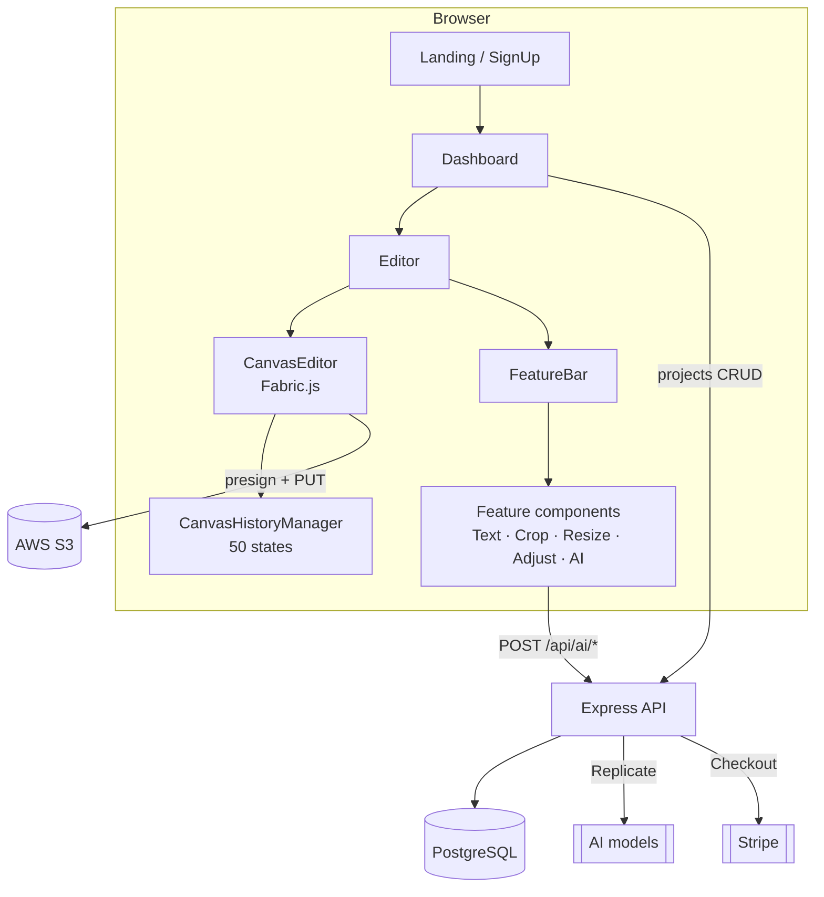

# Vision Crafter AI — Frontend

A browser-based AI image editor. Upload an image, edit it on an infinite-undo canvas, call AI models for background removal / outpainting / generation, and export to PNG, JPEG, WebP or PDF — all without leaving the tab.

This repo is the **React 19 + TypeScript client**. The API lives in [vision-crafter-ai-backend](https://github.com/OfficialAnujMore/vision-crafter-ai-backend).

---

## Demo

| | |
|---|---|
| **Video walkthrough** | _<!-- Paste your public YouTube / Google Drive link here -->_ |
| **Live app** | _<!-- Paste your deployed URL here -->_ |
| **Backend repo** | [OfficialAnujMore/vision-crafter-ai-backend](https://github.com/OfficialAnujMore/vision-crafter-ai-backend) |

---

## What it does

**Editing** — Fabric.js canvas with text (full typography + Google Fonts), crop with preset aspect ratios, canvas/image resize, and brightness / contrast / saturation adjustment.

**AI tools** — background removal, image extension (outpainting), text-to-image generation, and prompt-based image editing. Each runs server-side through Replicate and costs tokens.

**Backgrounds** — solid colour fills, your own uploads, or Unsplash search built into the panel.

**Persistence** — every canvas mutation is pushed to a 50-state undo/redo stack and a debounced 5-second autosave writes the flattened image straight to S3 (overwriting the same object key, so URLs stay stable) plus the `canvas_state` JSON to Postgres.

**Accounts & billing** — Google OAuth sign-in, a live token balance in the navbar, and a Stripe Checkout purchase modal for top-ups.

**Export** — PNG, JPEG, WebP, PDF.

---

## Tech stack

| Layer | Choice |
|---|---|
| Framework | React 19, TypeScript (strict) |
| Build | Vite 7 |
| Canvas | Fabric.js 7 |
| Routing | React Router 7 |
| HTTP | Axios (interceptors for auth refresh) |
| Auth | `@react-oauth/google` + HttpOnly cookies |
| State | React Context (`canvasContext`, `tokenContext`, `LoaderContext`) |
| UI | lucide-react, react-colorful, react-dropzone, sonner |
| Export | Canvas API + jsPDF |
| Styling | Plain CSS, one file per component, variables injected at runtime |

No CSS framework, no Redux — the app is small enough that Context plus a single history manager covers it.

---

## Architecture



### Canvas system
`CanvasEditor.tsx` owns the Fabric instance and registers the mutation listeners. The canvas ref and the active tool live in `canvasContext`, so any feature panel can reach the canvas without prop drilling. `CanvasHistoryManager` snapshots up to 50 states; undo/redo are also exposed as `window.canvasUndo()` / `window.canvasRedo()` for keyboard shortcuts.

### Autosave pipeline
```
canvas mutation → addToHistory() → debounce 5s
  → export canvas to blob
  → POST /api/storage/presign  (reuses the project's existing S3 key)
  → PUT bytes directly to S3   (bytes never touch the API server)
  → PATCH /api/projects/:id    (canvas_state JSON)
```
Because the presign call passes the existing key, the public URL never changes — a `?v=<timestamp>` cache-buster handles freshness.

### Tool activation
`BottomToolbar` click → `setActiveTool()` on the context → `FeatureBar` switches on the tool and renders the matching component from `components/FeatureComponents/`.

### API layer
A single Axios instance in `services/api/index.ts` sends `withCredentials` on every request. A response interceptor catches `401`, calls `POST /auth/refresh` once, and replays the original request. Service modules wrap each domain: `authService`, `projectService`, `canvasService`, `s3Service`, `aiService`, `paymentService`.

### Auth
The Google ID token is exchanged server-side; the API sets HttpOnly access/refresh cookies, so no JWT is ever readable from JavaScript. Only display data (name, picture) is cached in `localStorage` for UI, and `ProtectedRoute` gates `/dashboard`, `/editor/:projectId` and `/profile`.

---

## Getting started

### Prerequisites
- Node.js 18+
- The [backend](https://github.com/OfficialAnujMore/vision-crafter-ai-backend) running on `http://localhost:8000`
- A Google OAuth client ID with `http://localhost:5173` in **Authorized JavaScript origins**

### Install

```bash
git clone https://github.com/OfficialAnujMore/vision-crafter-ai-frontend.git
cd vision-crafter-ai-frontend
npm install
```

### Configure

Copy `.env.example` to `.env` and fill it in:

```env
# Required
VITE_API_URL=http://localhost:8000
VITE_GOOGLE_CLIENT_ID=your-google-client-id.apps.googleusercontent.com

# Optional — enables the Unsplash tab in the Background Image panel.
# Without these the tab renders a "not configured" hint and everything else still works.
VITE_UNSPLASH_API_URL=https://api.unsplash.com
VITE_UNSPLASH_ACCESS_KEY=your-unsplash-access-key
```

| Variable | Required | Purpose |
|---|---|---|
| `VITE_API_URL` | yes | Base URL of the backend API |
| `VITE_GOOGLE_CLIENT_ID` | yes | Google OAuth client ID for the sign-in button |
| `VITE_UNSPLASH_API_URL` | no | Unsplash API base (`https://api.unsplash.com`) |
| `VITE_UNSPLASH_ACCESS_KEY` | no | Unsplash public access key for background search |

Every AI feature, upload and payment goes through the backend, so no third-party secret other than the Unsplash *public* access key belongs in this repo's `.env`.

### Run

```bash
npm run dev
```

The app is served at `http://localhost:5173`.

> Running both services at once: `./dev.sh` in the parent `Vision-Crafter-AI` directory starts the backend and frontend together with prefixed logs.

---

## Scripts

| Command | Description |
|---|---|
| `npm run dev` | Vite dev server on `:5173` |
| `npm run build` | `tsc -b` type check, then production build to `dist/` |
| `npm run preview` | Serve the production build locally |
| `npm run lint` | ESLint |
| `npm test` | Vitest watch mode |
| `npm run test:run` | Vitest single run |
| `npm run test:coverage` | Coverage report (v8, thresholds set at 90/90/85/90) |

Vitest and the coverage gate are wired up in `vitest.config.ts`; the suite itself is still to be written.

---

## Project structure

```
src/
├── pages/                    # LandingPage, SignUp, Dashboard, Editor, Profile
├── components/
│   ├── Canvas/               # CanvasEditor, TopBar, BottomToolbar, FeatureBar,
│   │                         #   CanvasSelectionToolbar, DownloadImageModal
│   ├── FeatureComponents/    # One panel per tool: Text, Crop, Resize, Adjust,
│   │                         #   BackgroundColor, BackgroundImage, BackgroundRemover,
│   │                         #   ImageExtender, Generate
│   ├── CustomComponents/     # Button, Input, Slider, ColorPicker, FontPicker, modals
│   ├── PurchaseModal.tsx     # Stripe Checkout plan picker
│   └── TokenBalance.tsx      # Live balance pill in the navbar
├── services/
│   ├── api/                  # Axios instance + auth, project, canvas, s3, ai, payment
│   ├── config/               # API base URL and endpoint constants
│   └── export/               # PNG / JPEG / WebP / PDF export
├── context/                  # canvasContext, tokenContext
├── hooks/                    # useCanvasHistory
├── interface/                # Shared TypeScript types
├── constants/                # routes, colors, export formats, button/text variants
├── utils/                    # CanvasHistoryManager, googleFonts, injectColors, toast
├── styles/                   # CSS, mirrored to the component tree
└── layouts/                  # MainLayout
```

---

## Notable decisions

**Presigned direct-to-S3 uploads.** Image bytes go browser → S3 without passing through the API, which keeps the Node process off the hot path and out of body-size limits.

**Stable object keys.** A project owns one S3 key for its lifetime. Autosave overwrites in place, so renaming a project or saving 200 times never orphans an object or invalidates a stored URL.

**Tokens gated server-side.** The client shows the balance and the price of each action, but the deduction happens inside the same transaction as the AI call on the backend — the UI is never the source of truth.

**Context over a state library.** Three small contexts (canvas, tokens, loader) cover all cross-cutting state; adding Redux would have been more ceremony than the app needs.

---

## Related

- [Backend repository](https://github.com/OfficialAnujMore/vision-crafter-ai-backend) — Express 5, Prisma, PostgreSQL, S3, Replicate, Stripe
